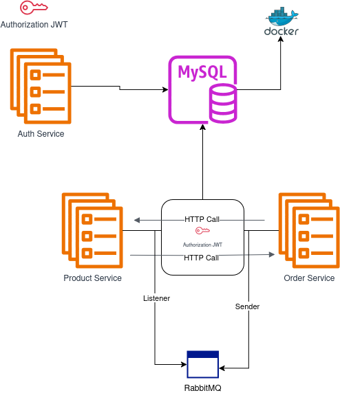

# Tecnologias

* **Java 17**
* **Spring Boot**
* **Spring Security**
* **Spring JPA**
* **JWT**
* **MYSQL**
* **API REST**
* **RabbitMQ**
* **Docker**
* **docker-compose**
* **Spring Cloud OpenFeign**
  

## Arquitetura Proposta

Teremos 3 APIs:

* **Auth-Service**: API de Autenticação
* **Order-Service**: API de criação de pedido.
* **Product-Service**: API de Produtos.

### Fluxo de execução de um pedido

O fluxo para realização de um pedido irá depender de comunicações **síncronas** (chamadas HTTP via REST) e **assíncronas** (mensageria com RabbitMQ).

O fluxo está descrito abaixo:

# Fluxo para Realização de Pedido

1. **Comunicações Síncronas e Assíncronas**  
   O fluxo para realização de um pedido envolve comunicações **síncronas** (APIs) e **assíncronas** (mensageria com RabbitMQ).

2. **Criação de Pedido**  
   O cliente faz uma requisição com a lista de produtos (ID e quantidade) para a API de pedidos.

3. **Validação de Estoque**  
   A API de pedidos chama a API de produtos para validar a disponibilidade de estoque.

4. **Erro de Estoque**  
   Se faltar estoque para algum produto, um erro é retornado.

5. **Criação do Pedido**  
   Caso o estoque seja válido, o pedido é salvo no MySQL com o status `PENDING`.

6. **Chamada ao Endpoint de Pagamento**  
   A API de pedidos chama o endpoint de pagamento para processar o pedido.

7. **Publicação na Fila de Atualização de Estoque**  
   A API de pedidos publica uma mensagem na fila do RabbitMQ para atualização do estoque.

8. **Revalidação de Estoque**  
   A API de produtos revalida o estoque após receber a mensagem da fila.

9. **Atualização de Estoque**  
   Se o estoque estiver ok, a API de pedidos altera o status do pedido para `APPROVED`.
## 🔑 Autenticação

### Objetivo:
Implementar autenticação com JWT e definir dois perfis de usuário: ADMIN e USER.

### Endpoints:
- **POST /api/user/auth/**  
  Autentica o usuário e retorna o token JWT.

- **GET /api/user/{email}**  
  Retorna as informações do usuário autenticado (requisição autenticada).

## ⚙️ CRUD de Produtos

### Objetivo:
Criar, ler, atualizar e deletar produtos.

### Endpoints:
- **GET /api/product**  
  Lista todos os produtos disponíveis.

- **POST /api/product**  
  Cria um novo produto (requere permissões de ADMIN).

- **PUT /api/product/{id}**  
  Atualiza um produto existente (requere permissões de ADMIN).

- **DELETE /api/product/{id}**  
  Deleta um produto (requere permissões de ADMIN).

- **GET /api/product/{id}**  
  Recupera detalhes de um produto específico.

   **POST /api/product/check-stock** 
  Checa estoque dos produtos

## ⚙️ CRUD de Categorias de Produtos

### Objetivo:
Gerenciar as categorias dos produtos.

### Endpoints:
- **GET /api/category/** 
  Lista todas as categorias.

- **POST /api/category/**  
  Cria uma nova categoria (requere permissões de ADMIN).

## ⚙️ Pedidos

### Objetivo:
Criar, visualizar e gerenciar pedidos feitos pelos usuários.

### Endpoints:
- **POST /api/order**  
  Cria um novo pedido (status "PENDENTE").

- **PUT /api/order/{id}/process-payment**  
  Realiza o pagamento do pedido, atualizando o status para "PAGO" e ajustando o estoque dos produtos.

- **GET /api/order/user_id**  
  Lista todos os pedidos do usuário autenticado.

## 📊 Consultas SQL Otimizadas

### Objetivo:
Executar consultas otimizadas para relatórios.

### Endpoints:
- **GET /api/order/top-buyers**  
  Retorna os 5 usuários que mais compraram.

- **GET /api/order/average-ticket**  
  Retorna o ticket médio dos pedidos de cada usuário.

- **GET /api/order/monthly-revenue**  
  Retorna o valor total faturado no mês.
